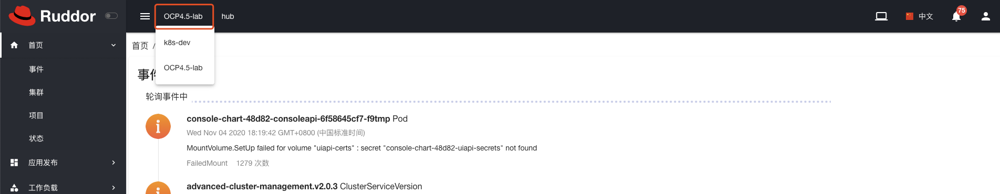
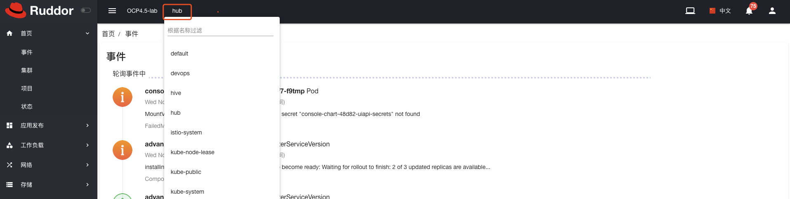
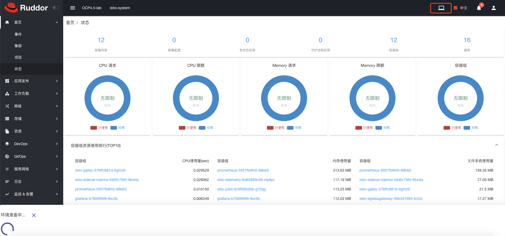
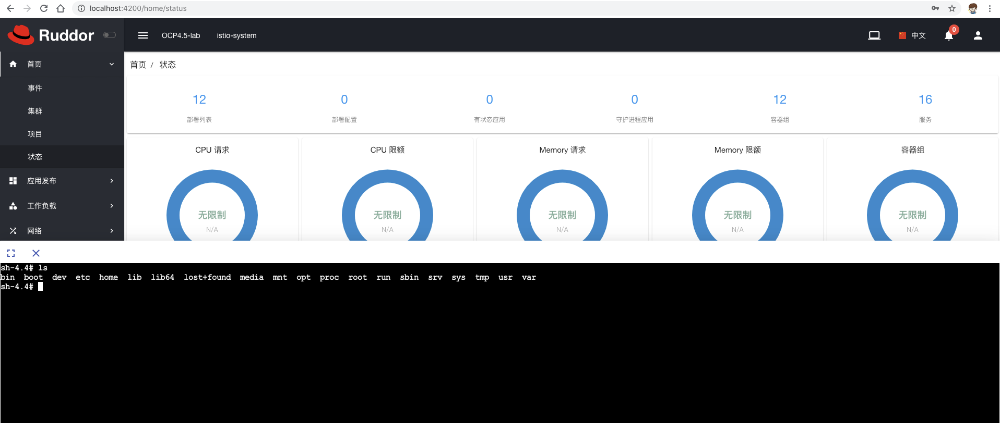
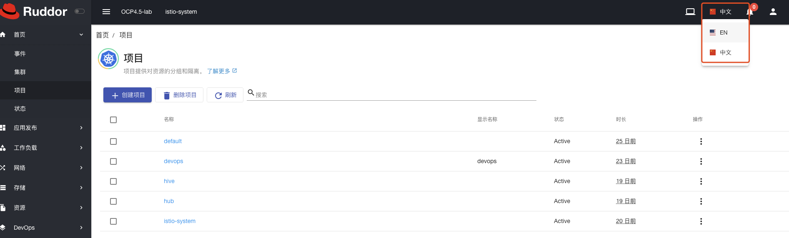
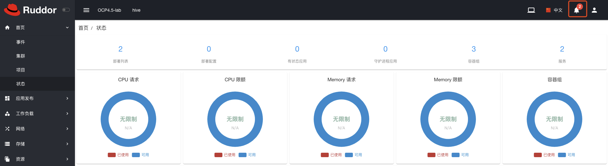
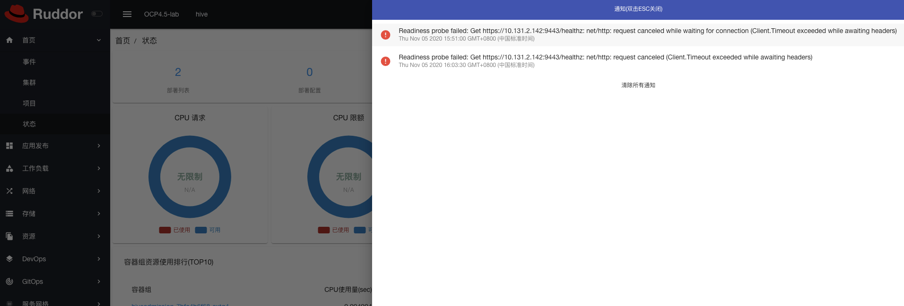

## 基础功能概览
---
 

<!-- toc -->

- [1 基础操作](#1-基础操作)
  * [1.1 集群选择](#11-集群选择)
  * [1.2 命名空间选择](#12-命名空间选择)
  * [1.3 CloudShell云终端](#13-CloudShell云终端)
  * [1.4 语言切换](#14-语言切换)
  * [1.5 实时Events](#15-实时Events)

<!-- tocstop -->

### 1 基础操作

本章节描述Ruddor Web Concole的基础功能概览。Ruddor WebConsole 提供对多个OCP和Kubernetes集群的统一管理。

#### 1.1 集群选择
----

用户登录之后，Console左上角会显示当前用户可访问的集群名称，点击该名称，下拉菜单显示当前可访问集群列表。

当选中待管理的集群之后，系统会自动获取当前用户在该集群下可访问的命名空间列表。当前用户如果没有可以访问的命名空间时命名空间列表处会显示N/A。

#### 1.2 命名空间选择
---

首先选择当前待管理的集群，命名空间下拉列表会自动显示当前用户可访问的命名空间，点击命名空间名称，可选择待管理的命名空间，也可输入名称字母进行模糊匹配。

当选中待管理命名空间之后，系统会自动导航到当前命名空间的资源概览页面。

#### 1.3 CloudShell云终端
---

Web Console 提供CloudShell功能，可一键启动终端控制台。
点击右上角CloudShell图标，启动cloudshell终端，在该终端里可以执行oc或者kubectl命令，快速进行调试。点击初始化页面的 X 按钮可终止CloudShell启动。

当CloudShell启动之后，点击全屏按钮进入全屏模式，鼠标移至标题栏可拖动CloudShell至屏幕其他位置，此时仍可浏览其他菜单资源，CloudShell会话始终保持，点击 X 退出该CloudShell。

#### 1.4 语言切换
---

Web Console支持中文和英文两种语言，点击右上角语言切换按钮选择对应语言。语言支持热切换，已经加载的图片语言需要重新打开页面即可。

#### 1.5 实时Events
---

Web Console支持实时展示资源的events，点击右上角的events图标侧边栏显示当前namespace里所有的正在发生的events。只显示最近500条events。当Events数量大于1000条时，数量展示为 ... ,鼠标移至该图标时Tooltips显示总events数量。

点击其中一条events可跳转至events详情页面。

